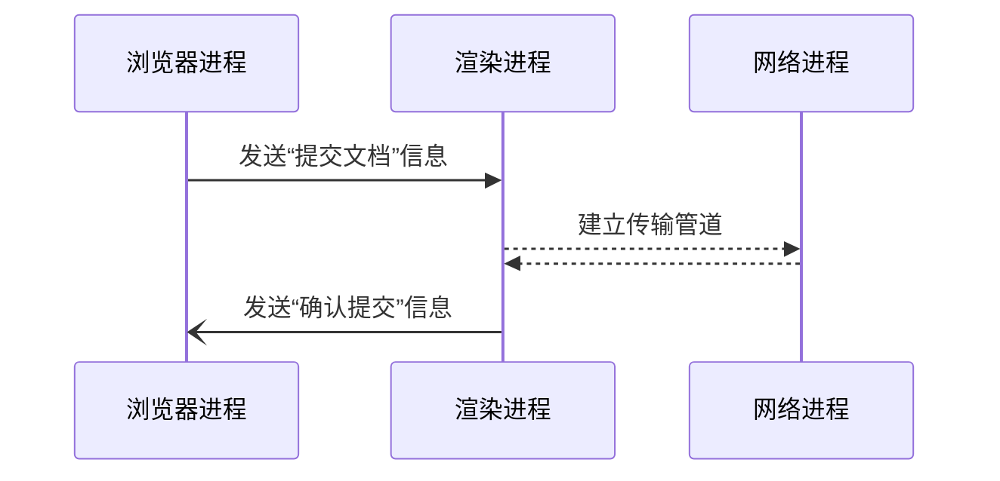

## 网络进程解析获取到的数据包

响应头中的Content-type来判断响应数据的类型

1. 如果是Content-Type = application/octet-stream字节流类型，就将该请求交给下载管理器
2. 如果是 Content-Type =text/html，就通知浏览器进程获取到文档准备渲染

## 准备渲染进程

浏览器进程判断是否是同一站点
>根据当前页面B是否是从页面A打开的并且和页面A是同一站点（根域名和协议一样就被认为统一站点），如果是则复用之前网页的进程，否则新创建一个单独的渲染进程

## 提交文档

>“文档”指URL请求的响应体数据

1. 浏览器进程发送“提交文档”给渲染进程
2. 渲染进程接收到消息之后，会和网络进程建立传输数据的通道
3. 文档数据传输完成后，返回“确认提交”的消息给浏览器进程
4. 浏览器进程收到“确认提交”的消息后，更新浏览器的页面状态，包括安全状态、地址栏的URL、前进后退的历史状态，并更新Web页面。**此时web页面是空白** 